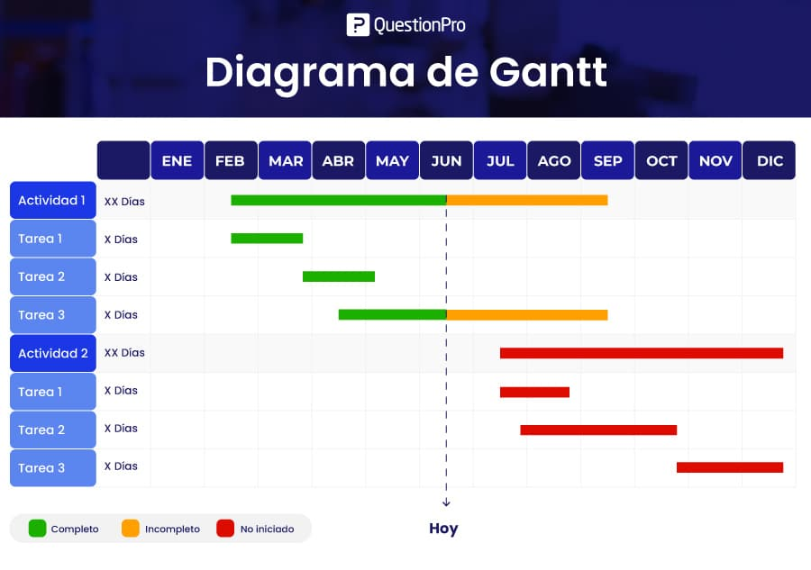

# 📘 Sección 2: Gestión del Tiempo y Cronograma de Entregas

## 2.1 La Matriz de Priorización de Eisenhower
Para evitar la improvisación y el trabajo apresurado de última hora, el equipo debe clasificar las tareas del proyecto utilizando los principios de administración del tiempo y categorización de prioridades ([Universidad Católica de la Santísima Concepción, 2021](../referencias/referencias_bibliograficas.md#ref-ucsc-2021)):

| | **Urgente** | **No Urgente** |
| :--- | :--- | :--- |
| **Importante** | **Cuadrante I: HACER YA** • Corrección de errores críticos que bloquean la entrega. • Resolución de conflictos de fusión (*merge conflicts*). | **Cuadrante II: PLANIFICAR** *(Zona de éxito)* • Redacción de secciones con días de anticipación. • Fichaje de referencias APA y revisión cruzada de PRs. |
| **No Importante** | **Cuadrante III: DELEGAR / AUTOMATIZAR** • Búsqueda manual de sintaxis de formato (usar plantillas). • Correcciones estéticas no requeridas en la rúbrica. | **Cuadrante IV: ELIMINAR** • Conversaciones prolongadas sin minuta en chats. • Reestructuración innecesaria del repositorio a última hora. |

> 💡 **Regla de Ejecución:** Más del 80% del tiempo de desarrollo del proyecto debe concentrarse en las actividades del **Cuadrante II** (Planificación).

---

## 2.2 Técnica Pomodoro para Trabajo Profundo
Para optimizar las sesiones individuales de investigación y redacción, se adopta la estructura de bloques de enfoque continuos descrita en las guías metodológicas de productividad ([Todoist, 2024](../referencias/referencias_bibliograficas.md#ref-todoist-2024)):

1. **Bloque de Enfoque (25 min):** Redacción continua sin interrupciones (notificaciones silenciadas).
2. **Pausa Corta (5 min):** Descanso visual y estiramiento físico.
3. **Ciclo Completo:** Tras completar 4 bloques de trabajo (100 minutos netos), realizar un descanso prolongado de 20 a 30 minutos.

---

## 2.3 Estrategia de Cronograma y Buffer de Seguridad (48 Horas)

El trabajo en equipo exige prever contingencias técnicas o personales. Por ello, el proyecto se organiza en fases con una fecha límite interna previa a la fecha oficial.

### Regla del Buffer de Contingencia (48 Horas):
La fecha límite de entrega acordada internamente por el grupo debe fijarse **mínimo 48 horas antes** de la hora de cierre de la plataforma universitaria. Como ejemplo, para este proyecto este margen de tiempo se reserva exclusivamente para:
* Resolver fallas imprevistas de conexión o problemas al exportar Markdown a PDF.
* Realizar una lectura final completa para auditar la coherencia global del manual.
* Verificar la integridad de los enlaces hipertextuales en la rama principal `main`.

### Representación Visual de la Planificación
A continuación se presenta el cronograma estimado para las fases de un proyecto:

