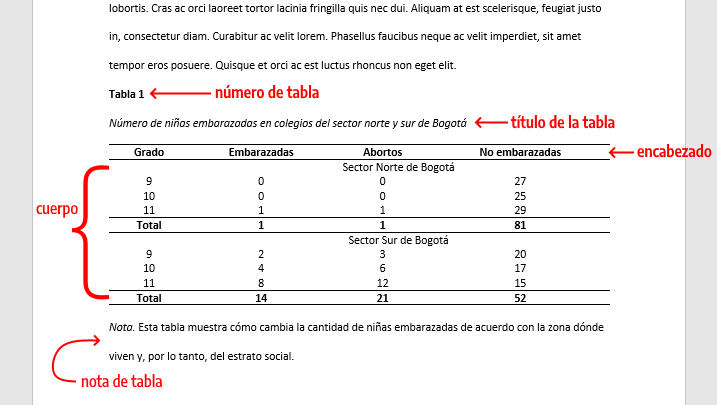
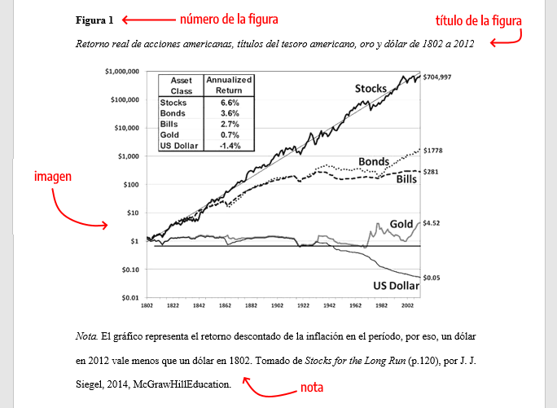
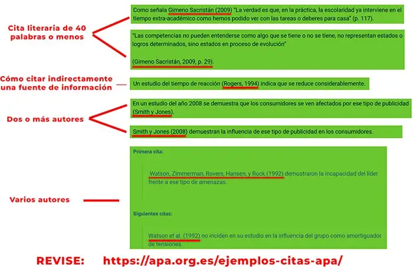
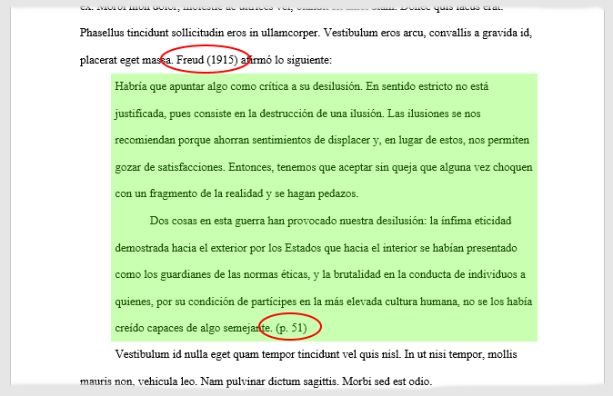

# 📘 Sección 1: Organización del Equipo y Definición de Roles

## 1.1 Introducción y Justificación
Uno de los principales problemas en los trabajos universitarios colaborativos es la falta de claridad sobre quién hace qué y en qué plazos. La experiencia en la gestión de proyectos demuestra que la simple repartición aleatoria de partes sin una coordinación estructurada suele derivar en documentos incoherentes, entregas fuera de tiempo o sobrecarga de trabajo en un solo integrante.

Para evitar esto, este manual adopta los principios de autogestión y distribución formal de responsabilidades recomendados para el trabajo colaborativo de alto rendimiento ([Schwaber y Sutherland, 2020](../referencias/referencias_bibliograficas.md#ref-scrum-2020)).

---

## 1.2 Matriz de Responsabilidades (Modelo RACI)
En lugar de que todos hagan de todo al mismo tiempo, el equipo debe asignar roles principales según la matriz **RACI** (*Responsable, Aprobador, Consultado e Informado*):

| Rol del Estudiante | Función Principal | Responsable (*Responsible*) | Aprobador (*Accountable*) |
| :--- | :--- | :--- | :--- |
| **Líder de Proyecto** | Coordinar el cronograma y resolver bloqueos entre integrantes. | Asignación de tareas y seguimiento del tablero Kanban. | Velar por el cumplimiento de las fechas límite. |
| **Redactor Técnico** | Sintetizar la información y redactar en formato Markdown. | Escribir los contenidos asignados en su propia rama. | Unificar el tono y estilo del texto según ([Normas APA, 2024](../referencias/referencias_bibliograficas.md#ref-apa-2024)). |
| **Investigador / Documentalista** | Buscar fuentes académicas válidas y gestionar las referencias. | Recopilar bibliografía con enlaces funcionales. | Validar la veracidad de la información recopilada. |
| **Revisor de Calidad & Git** | Auditar ortografía, formato y controlar el repositorio. | Comprobar enlaces, carpetas y sintaxis de Markdown. | Aprobar los *Pull Requests* y realizar las fusiones a `main`. |

> 📌 **Nota sobre los roles:** En equipos de dos personas (como el de este proyecto), cada integrante asume responsabilidades compartidas. Sin embargo, la regla inquebrantable de control de versiones es que **nadie aprueba su propio Pull Request**; la revisión de calidad siempre la realiza el compañero.

---

## 1.3 Protocolo de Comunicación Síncrona vs. Asíncrona
Para no saturar los grupos de mensajería ni depender de reuniones presenciales constantes, adoptamos el flujo de trabajo asíncrono recomendado por la documentación de GitHub ([GitHub, 2024](../referencias/referencias_bibliograficas.md#ref-github-2024)):

1. **Comunicación Asíncrona (Principal):**
   * **Medio:** Issues de GitHub, comentarios en los Pull Requests y notas en el tablero Kanban.
   * **Uso:** Asignación de tareas, revisión de avances y observaciones sobre correcciones específicas.
   * **Ventaja:** Deja un registro histórico transparente de todo lo que se ha trabajado y acordado.

2. **Comunicación Síncrona (Excepcional):**
   * **Medio:** Google Meet, Discord o llamadas breves.
   * **Uso:** Sesiones cortas de alineación (máximo 15-20 minutos) al inicio de cada fase o ante dudas complejas.
   * **Regla de Oro:** Todo acuerdo tomado verbalmente debe anotarse como comentario en la *Issue* correspondiente.

---

## 1.4 Flujo Visual de Comunicación
El siguiente diagrama resume cómo el equipo debe tomar decisiones según la urgencia del caso:


# 📘 Sección 2: Gestión del Tiempo y Cronograma de Entregas

## 2.1 La Matriz de Priorización de Eisenhower
Para evitar la improvisación y el trabajo apresurado de última hora, el equipo debe clasificar las tareas del proyecto utilizando los principios de administración del tiempo y categorización de prioridades ([Universidad Católica de la Santísima Concepción, 2021](../referencias/referencias_bibliograficas.md#ref-ucsc-2021)):

| | **Urgente** | **No Urgente** |
| :--- | :--- | :--- |
| **Importante** | **Cuadrante I: HACER YA**<br>• Corrección de errores críticos que bloquean la entrega.<br>• Resolución de conflictos de fusión (*merge conflicts*). | **Cuadrante II: PLANIFICAR** *(Zona de éxito)*<br>• Redacción de secciones con días de anticipación.<br>• Fichaje de referencias APA y revisión cruzada de PRs. |
| **No Importante** | **Cuadrante III: DELEGAR / AUTOMATIZAR**<br>• Búsqueda manual de sintaxis de formato (usar plantillas).<br>• Correcciones estéticas no requeridas en la rúbrica. | **Cuadrante IV: ELIMINAR**<br>• Conversaciones prolongadas sin minuta en chats.<br>• Reestructuración innecesaria del repositorio a última hora. |

> 💡 **Regla de Ejecución:** Más del 80% del tiempo de desarrollo del proyecto debe concentrarse en las actividades del **Cuadrante II** (Planificación).

---

## 2.2 Técnica Pomodoro para Trabajo Profundo
Para optimizar las sesiones individuales de investigación y redacción, se adopta la estructura de bloques de enfoque continuos descrita en las guías metodológicas de productividad ([Todoist, 2024](../referencias/referencias_bibliograficas.md#ref-todoist-2024)):

1. **Bloque de Enfoque (25 min):** Redacción continua sin interrupciones (notificaciones silenciadas).
2. **Pausa Corta (5 min):** Descanso visual y estiramiento físico.
3. **Ciclo Completo:** Tras completar 4 bloques de trabajo (100 minutos netos), realizar un descanso prolongado de 20 a 30 minutos.

---

## 2.3 Estrategia de Cronograma y Buffer de Seguridad (48 Horas)

El trabajo en equipo exige prever contingencias técnicas o personales. Por ello, el proyecto se organiza en fases con una fecha límite interna previa a la fecha oficial.

### Regla del Buffer de Contingencia (48 Horas):
La fecha límite de entrega acordada internamente por el grupo debe fijarse **mínimo 48 horas antes** de la hora de cierre de la plataforma universitaria. Como ejemplo, para este proyecto este margen de tiempo se reserva exclusivamente para:
* Resolver fallas imprevistas de conexión o problemas al exportar Markdown a PDF.
* Realizar una lectura final completa para auditar la coherencia global del manual.
* Verificar la integridad de los enlaces hipertextuales en la rama principal `main`.

### Representación Visual de la Planificación
A continuación se presenta el cronograma estimado para las fases de un proyecto:


# 📘 Sección 3: Ecosistema de Herramientas Colaborativas

## 3.1 Entorno de Trabajo Integrado (VS Code + Git + GitHub)


Para garantizar la consistencia técnica del proyecto, el equipo adopta un stack de herramientas estandarizado que permite el desarrollo, control de versiones y edición simultánea de documentación.

| Herramienta | Rol en el Proyecto | Justificación Técnica |
| :--- | :--- | :--- |
| **Visual Studio Code** | Editor de código y documentación | Soporta extensiones de previsualización en tiempo real de Markdown, resaltado de sintaxis y terminal integrada. |
| **Git** | Control de versiones local | Registra el historial de cambios mediante *commits* e independiza el trabajo individual mediante ramas (*branches*). |
| **GitHub** | Repositorio remoto y gestión | Centraliza el código fuente, hospeda el tablero Kanban, gestiona revisiones con *Pull Requests* y almacena la documentación ([GitHub, 2024](../referencias/referencias_bibliograficas.md#ref-github-2024)). |

---

## 3.2 Estándar de Redacción Técnica en Markdown
Todo el manual se redacta utilizando la sintaxis de marcado ligero Markdown ([Gruber, 2004](../referencias/referencias_bibliograficas.md#ref-gruber-2004)). Este formato asegura que el texto sea perfectamente legible como código fuente plano y fácil de exportar a PDF o HTML.

### Reglas Clave de Estilo Markdown:
1. **Estructura Jerárquica de Títulos:** 
   * Se utiliza un solo `#` (Título 1) para el nombre principal de la sección.
   * Se utilizan `##` (Título 2) para subsecciones y `###` (Título 3) para apartados específicos.
2. **Resaltado y Listas:** Uso moderado de negritas (`**texto**`) para términos clave y listas no ordenadas (`*`) para descomponer conceptos densos.
3. **Tablas y Bloques:** Tablas estructuradas para matrices comparativas y bloques de cita (`>`) para reglas inquebrantables o advertencias.

---

## 3.3 Convención de Mensajes de Commit (Conventional Commits)
Para mantener un historial de cambios profesional y rastreable, los integrantes del equipo deben redactar sus mensajes de *commit* siguiendo el estándar de prefijos:

* `Docs(sección):` Para adiciones o mejoras en los archivos de documentación (Ej: `Docs(Sec-3): Redactar ecosistema de herramientas`).
* `Fix(módulo):` Para corrección de enlaces rotos, sintaxis de Markdown o errores de formato.
* `Refactor(estructura):` Para reorganización de carpetas o renombrado de archivos sin alterar el contenido teórico.
* `Changelog:` Para actualizaciones en el historial de versiones del proyecto.

> 📌 **Vinculación obligatoria con Issues:** Todo commit que cierre una tarea programada debe incluir la etiqueta correspondiente al final de su mensaje (Ej: `Closes #3`).

# 📘 Sección 4: Normas de Formato, Tipografía y Estilo (APA 7)

## 4.1 Reglas Generales de Formato y Estructura Visual
Para la producción de documentos académicos dentro del proyecto, se adoptan los lineamientos del manual de estilo de la APA en su 7.ª edición ([American Psychological Association, 2020](../referencias/referencias_bibliograficas.md#ref-apastyle-2020)), adaptados al entorno de renderizado en Markdown:

* **Márgenes:** En documentos finales exportados a PDF/Word, se aplica un margen estándar de **1 pulgada (2.54 cm)** en todos los lados (superior, inferior, izquierdo y derecho).
* **Fuentes Tipográficas Aceptadas:** Se establece el uso de tipografías claras con legibilidad comprobada:
  * *Sin serifa:* Arial (11 pt), Calibri (11 pt) o Lucida Sans Unicode (10 pt).
  * *Con serifa:* Times New Roman (12 pt) o Georgia (11 pt).
* **Interlineado y Alineación:**
  * **Interlineado:** Doble espacio (2.0) sin espacio adicional entre párrafos en documentos impresos/finales. En archivos `.md`, los párrafos se separan con una línea en blanco.
  * **Alineación:** Párrafos alineados a la izquierda con margen derecho irregular (sin justificar).
  * **Sangría:** Sangría de primera línea a 1.27 cm (0.5 in) en la entrega formal de trabajos académicos.

---

## 4.2 Jerarquía de Títulos y Subtítulos
El documento sigue una estructura visual clara utilizando los niveles de encabezado Markdown alineados a la jerarquía de APA 7:

| Nivel APA 7 | Formato APA | Sintaxis en Markdown | Aplicación en el Manual |
| :--- | :--- | :--- | :--- |
| **Nivel 1** | Centrado, Negrita, Título Principal | `# Título Nivel 1` | Secciones principales del manual. |
| **Nivel 2** | Alineado a la izquierda, Negrita | `## Título Nivel 2` | Subsecciones teóricas o metodológicas. |
| **Nivel 3** | Alineado a la izquierda, Negrita, Cursiva | `### Título Nivel 3` | Desglose de puntos específicos dentro de un subtema. |

---

## 4.3 Estructura Visual de Tablas, Figuras y Elementos de Bloque
Toda representación gráfica o tabular incorporada a la documentación debe cumplir con las pautas de presentación visual de APA 7 ([American Psychological Association, 2020](../referencias/referencias_bibliograficas.md#ref-apastyle-2020)):

1. **Tablas:**
   * Tienen un formato limpio y minimalista.
   * Llevan número de tabla (p. ej., **Tabla 1**) en negrita, seguido de un título breve y descriptivo en cursiva.
   * Solo incluyen líneas horizontales para separar encabezados y filas finales, evitando líneas verticales.

   

2. **Figuras (Diagramas, Capturas o Ilustraciones):**
   * Llevan la etiqueta **Figura X** en negrita arriba de la imagen, con su título explicativo.
   * Deben incorporar una nota al pie en caso de requerir atribución de fuente o aclaración técnica.

   
   
# 📘 Sección 5: Citación de Fuentes, Referencias y Ética Académica

## 5.1 Tipos de Citas: Directas e Indirectas (Paráfrasis)
El uso riguroso de fuentes externas garantiza la validez técnica de la documentación del proyecto ([American Psychological Association, 2020](../referencias/referencias_bibliograficas.md#ref-apastyle-2020)). Para acreditar el conocimiento de otros autores se aplican dos modalidades de citación:

* **Cita Directa (Textual):** Transcripción exacta de las palabras del autor original.
  * **Cita corta (menos de 40 palabras):** Se incorpora dentro del párrafo entre comillas, indicando autor, año y página específica (`p. X`).
  * **Cita larga (40 palabras o más):** Se coloca en un bloque independiente sin comillas, con sangría y fuente acreditada.
* **Cita Indirecta (Paráfrasis):** Expresión de las ideas de un autor utilizando redacción propia sin alterar el significado original. Es la forma preferida para la redacción técnica en este manual, ya que demuestra comprensión sintética. Requiere indicar autor y año ([American Psychological Association, 2020](../referencias/referencias_bibliograficas.md#ref-apastyle-2020)).

   

   

---

## 5.2 Prevención del Plagio y Ética Académica
El plagio —presentar ideas, textos o código de terceros como propios sin la correspondiente atribución— constituye una falta grave contra la ética académica y profesional.

1. **Acreditación continua:** Toda afirmación técnica que no sea de dominio público o creación propia del equipo debe llevar su cita parentética vinculada al catálogo central de referencias.
2. **Uso responsable de Código Abierto:** Al reutilizar fragmentos de código, librerías o algoritmos de repositorios públicos, se debe documentar la fuente y respetar la licencia correspondiente (MIT, Apache, GPL).
3. **Uso ético de Herramientas de IA:** Las consultas o fragmentos generados mediante herramientas de inteligencia artificial deben ser auditados, validados por el equipo e integrados con criterio propio, evitando el copiado directo sin análisis previo.

---

## 5.3 Gestores Bibliográficos Recomendados (Mendeley / Zotero)
Para mantener la consistencia bibliográfica en proyectos colaborativos de gran escala, se recomienda el uso de gestores de referencias bibliográficas:

| Herramienta | Características Principales | Uso en el Equipo |
| :--- | :--- | :--- |
| **Zotero** | Software libre, integración con navegadores y generación automática de referencias APA 7. | Extracción rápida de metadatos desde repositorios y portales académicos. |
| **Mendeley** | Gestor institucional con lector de PDF integrado y organización por carpetas compartidas. | Centralización y lectura analítica de artículos científicos. |

# 📘 Sección 6: Control de Calidad, Revisión y Presentación

## 6.1 Auditoría de Calidad Previa a Entregas
Para asegurar que todo documento entregado por el equipo cumpla con los máximos estándares académicos y técnicos, ningún archivo se considera "listo para entrega" sin haber superado una auditoría de revisión cruzada por parte de un integrante distinto al autor principal ([Schwaber y Sutherland, 2020](../referencias/referencias_bibliograficas.md#ref-scrum-2020)).

---

## 6.2 Lista de Chequeo (Checklist) Pre-Entrega
Antes de realizar la fusión final a la rama `main` y proceder a la exportación, el equipo debe verificar el cumplimiento de los siguientes puntos:

### 1. Revisión Redaccional y Ortográfica
* [ ] **Cero errores ortográficos y gramaticales:** Lectura completa asistida por correctores del editor (VS Code CodeSpell / Languagetool).
* [ ] **Tono y estilo uniforme:** Redacción en tercera persona o voz impersonal académica a lo largo de todo el texto.
* [ ] **Claridad sintáctica:** Uso de oraciones cortas, párrafos estructurados y lenguaje técnico preciso.

### 2. Consistencia de Formato y Markdown
* [ ] **Jerarquía de títulos impecable:** Uso ordenado de `#`, `##` y `###` sin saltar niveles de encabezado.
* [ ] **Estilo APA 7 respetado:** Tablas minimalistas con encabezados claros y figuras etiquetadas correctamente.
* [ ] **Bloques de código delimitados:** Sintaxis de comandos e instrucciones formateadas dentro de bloques ` ``` `.

### 3. Integridad de Fuentes y Enlaces
* [ ] **Citas pareadas:** Toda cita en el texto `([Autor, Año])` cuenta con su ficha correspondiente en `referencias_bibliograficas.md`.
* [ ] **Hipervínculos funcionales:** Comprobación de que todas las rutas relativas (`../referencias/...#ref-id`) abran correctamente sin errores 404.
* [ ] **URLs públicas:** Los enlaces del catálogo bibliográfico apuntan a sitios estables y accesibles sin credenciales.

### 4. Presentación y Exportación a PDF
* [ ] **Compilación exitosa:** Exportación limpia desde Markdown a PDF utilizando Pandoc, Markdown PDF (Extensión VS Code) o la vista previa oficial.
* [ ] **Paginación y márgenes:** Verificación visual de márgenes (2.54 cm) y saltos de página adecuados (evitando títulos huérfanos al final de página).

---

## 6.3 Protocolo de Presentación Final
Una vez validada la lista de chequeo:
1. Se firma la revisión del Pull Request en GitHub.
2. Se genera la versión distribuible en PDF desde la rama principal `main`.
3. Se almacena el artefacto final en la carpeta de entregas acordada con su correspondiente número de versión (`v1.0`).

# 📚 Fuentes Bibliográficas y Documentación del Proyecto

<a id="ref-github-2024"></a>
### GitHub. (2024)
GitHub. (2024). *GitHub Flow: Flujo de trabajo basado en ramas*. Documentación Oficial de GitHub.  
🔗 **Enlace de acceso:** [https://docs.github.com/es/get-started/using-github/github-flow](https://docs.github.com/es/get-started/using-github/github-flow)  
* **Aporte al manual:** Define las buenas prácticas para el trabajo colaborativo en equipo mediante ramas (*feature branches*), revisiones de código y *Pull Requests*.

---

<a id="ref-apa-2024"></a>
### Normas APA. (2024)
Normas APA. (2024). *Guía de citación y referencia en formato APA (7.ª edición)*. Portal Oficial Normas APA.  
🔗 **Enlace de acceso:** [https://normasapa.in/](https://normasapa.in/)  
* **Aporte al manual:** Establece los estándares internacionales de formato, márgenes, jerarquía de títulos y referencias bibliográficas para trabajos académicos.

---

<a id="ref-scrum-2020"></a>
### Schwaber y Sutherland. (2020)
Schwaber, K., y Sutherland, J. (2020). *La Guía de Scrum: Las Reglas del Juego*. Scrum.org.  
🔗 **Enlace de acceso:** [https://scrumguides.org/scrum-guide.html#spanish](https://scrumguides.org/scrum-guide.html#spanish)  
* **Aporte al manual:** Aporta los principios de autogestión, asignación de responsabilidades, reuniones de alineación y entregas incrementales para equipos de trabajo.

---

<a id="ref-todoist-2024"></a>
### Todoist. (2024)
Todoist. (2024). *La guía definitiva de la Técnica Pomodoro para la productividad*. Doist Inc.  
🔗 **Enlace de acceso:** [https://todoist.com/es/productivity-methods/pomodoro-technique](https://todoist.com/es/productivity-methods/pomodoro-technique)  
* **Aporte al manual:** Proporciona las pautas estructuradas para trabajar en bloques de enfoque de 25 minutos con pausas cortas para sostener la concentración en la redacción técnica.

---

<a id="ref-ucsc-2021"></a>
### Universidad Católica de la Santísima Concepción. (2021)
Universidad Católica de la Santísima Concepción. (2021). *Estrategia de estudio: Matriz de priorización de Eisenhower*. Portal del Programa de Acompañamiento Académico (PAP - UCSC).  
🔗 **Enlace de acceso:** [https://pap.ucsc.cl/2021/08/18/estrategia-de-estudio-matriz-de-priorizacion-de-eisenhower/](https://pap.ucsc.cl/2021/08/18/estrategia-de-estudio-matriz-de-priorizacion-de-eisenhower/)  
* **Aporte al manual:** Fundamenta la clasificación de actividades académicas en cuadrantes de urgencia e importancia para mejorar la toma de decisiones y evitar la saturación de tareas.

---

<a id="ref-gruber-2004"></a>
### Gruber. (2004)
Gruber, J. (2004). *Markdown Syntax Documentation*. Daring Fireball.  
🔗 **Enlace de acceso:** [https://daringfireball.net/projects/markdown/syntax](https://daringfireball.net/projects/markdown/syntax)  
* **Aporte al manual:** Define las especificaciones de sintaxis del lenguaje de marcado ligero Markdown para la creación de documentos legibles, portables y convertibles a formatos web o PDF.

---

<a id="ref-apastyle-2020"></a>
### American Psychological Association. (2020)
American Psychological Association. (2020). *Style and Grammar Guidelines: APA Style (7th ed.)*. APA.  
🔗 **Enlace de acceso:** [https://apastyle.apa.org/](https://apastyle.apa.org/)  
* **Aporte al manual:** Sitio web oficial de la APA que establece las reglas definitivas para la redacción, citación y estructuración de referencias bibliográficas a nivel internacional.