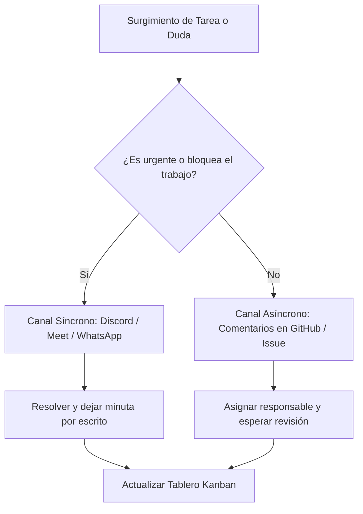

# 📊 Diagrama de Flujo para Toma de Decisiones y Comunicación

```mermaid
graph TD
    A[Surgimiento de Tarea o Duda] --> B{¿Es urgente o bloquea el trabajo?}
    B -- Sí --> C[Canal Síncrono: Discord / Meet / WhatsApp]
    B -- No --> D[Canal Asíncrono: Comentarios en GitHub / Issue]
    C --> E[Resolver y dejar minuta por escrito]
    D --> F[Asignar responsable y esperar revisión]
    E --> G[Actualizar Tablero Kanban]
    F --> G
```